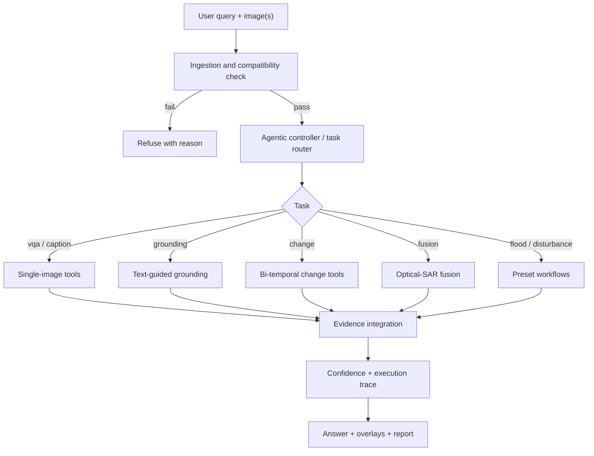

# SatQuery AI

> **An agentic vision-language assistant for multimodal remote-sensing image analysis through text queries.**

**Smart India Hackathon 2026** · ISRO / Space Applications Centre<br>
Problem Statement **26167** · Theme: Space Technology · Category: Software


---

## 1. What this project does

> Upload one or two satellite images, ask a question in plain English, and SatQuery AI selects the analysis, runs it, and returns an answer with visual evidence, confidence and an auditable execution log.

### Example queries

| Query | Inputs | What runs |
|---|---|---|
| "Describe the land cover in this image." | 1 image | Scene measurements → captioning/VQA |
| "Highlight the water body." | 1 image | Text-guided grounding → mask, polygons, area |
| "What changed between these two dates, and where?" | Bi-temporal pair | Co-registration → change map → change description |
| "Has the built-up area increased, decreased, or stayed the same?" | Bi-temporal pair | Change analysis → change-based VQA |
| "Use the optical and SAR images together to find built-up and water regions." | Optical + SAR pair | Fusion → agreement map |

## 2. Why it exists

Most remote-sensing AI tools solve one task with one model. Using them means knowing GIS workflows, satellite characteristics and model selection. A non-expert cannot simply ask a question. Some questions also cannot be answered from one image: they need two dates, or optical plus SAR (radar sees through cloud and at night, optical carries spectral detail).

A general-purpose LLM or VLM is also not enough. Published benchmarks show that vision-language models tuned for remote sensing do better than generic ones on satellite tasks, which is why this project requires domain adaptation and a routing layer rather than one generic model.

## 3. Features

- **Single-image analysis:** VQA, captioning and text-guided region grounding
- **Bi-temporal analysis:** change description, change-based VQA and spatial change maps
- **Optical–SAR fusion:** agreement maps showing confirmed, optical-only and SAR-only regions
- **Agentic controller:** reads the query, checks inputs, selects registry tools and sets permitted parameters
- **Compatibility checks:** modality, format, CRS, overlap and resolution
- **Evidence-first answers:** overlays, GeoJSON and measurements with stable IDs
- **Confidence and traceability:** visible confidence breakdown plus task, router, tool, parameter and timing logs
- **Reports and workflows:** PDF, JSON and GeoJSON exports, plus flood and land-disturbance candidates for human review
- **Evidence-bounded follow-up chat** and a benchmarks page showing only measured results

## 4. Architecture



### Three layers

1. **Perception**: remote-sensing-adapted vision-language model plus measured scene statistics.
2. **Specialists**: VQA, captioning, grounding, change analysis, fusion.
3. **Orchestration**: controller that routes, sequences, integrates and logs.

> **Evidence-first principle:** numbers in an answer come from measured pixels or model outputs stored in an evidence bundle. The language layer can rephrase, but any number that is not in the bundle is rejected.

## 5. Tech stack and why

| Technology | Why it is used |
|---|---|
| Python | Main language for ML and geospatial work |
| PyTorch + HuggingFace Transformers | Load and run the vision-language model |
| PEFT / LoRA | Adapt the VLM to BigEarthNet without full retraining, within a small compute budget |
| Laya (open source) | Typed-decision engine for choosing the task; fast, returns a confidence, avoids a full LLM call just to route. A rule-based router is the fallback |
| rasterio + NumPy | Read GeoTIFF/TIFF and handle multispectral and SAR band arrays |
| OpenCV | Conventional image operations only: resizing, filtering, drawing, ORB/RANSAC fallback |
| scikit-image / SciPy / scikit-learn | Thresholding, morphology, clustering |
| FastAPI | API layer. Model inference is run in a worker thread/process, not directly in async handlers |
| React + TypeScript + Vite + Tailwind | Analyst console and landing page |
| MapLibre GL / Leaflet | Georeferenced map overlays |
| reportlab | PDF report generation |
| pytest | Automated tests |

## 6. Research foundation

These papers are the basis for our design. Details of each are below. Please verify the citation details against the publisher versions before final submission.

### 6.1 RSVQA: Visual Question Answering for Remote Sensing Data
Lobry, Marcos, Murray, Tuia. *IEEE Transactions on Geoscience and Remote Sensing*, 2020.

Introduced visual question answering for remote-sensing images: users ask natural-language questions about a satellite or aerial image instead of running a task-specific model. The authors built question-answer datasets automatically by querying OpenStreetMap for labels, and trained a model that combines an image encoder with a text encoder.
**Limit we build past:** one image, one task, no routing, no SAR, no change reasoning.
**How we use it:** defines the single-image VQA task and its question types (presence, counting, comparison).

### 6.2 RSVQA Meets BigEarthNet: A New, Large-Scale, Visual Question Answering Dataset for Remote Sensing
Lobry, Demir, Tuia. *IGARSS*, 2021.

Shows how to turn BigEarthNet's land-cover labels into a large VQA dataset.
**How we use it:** the method our BigEarthNet question-answer builder (`train/build_vqa_from_bigearthnet.py`) follows for adapting the model, since the problem statement names BigEarthNet as the primary adaptation dataset.

### 6.3 VRSBench: A Versatile Vision-Language Benchmark Dataset for Remote Sensing Image Understanding
Li, Ding, Elhoseiny. *NeurIPS Datasets and Benchmarks*, 2024.

A benchmark with 29,614 human-verified detailed captions, 52,472 object references and 123,221 question-answer pairs, covering captioning, grounding and VQA. Their experiments found that remote-sensing-tuned models beat a general baseline that was not fine-tuned on the benchmark.
**How we use it:** evidence that domain adaptation matters, and the evaluation set for single-image captioning, grounding and VQA (`scripts/eval_vrsbench.py`).

### 6.4 Change Detection Meets Visual Question Answering (CDVQA)
Yuan, Mou, Xiong, Zhu. *IEEE Transactions on Geoscience and Remote Sensing*, 2022.

Combines change detection with question answering on bi-temporal image pairs. The baseline has four parts: multi-temporal feature encoding, multi-temporal fusion, multi-modal fusion and answer prediction, plus a change-enhancing module.
**How we use it:** the reference design and the evaluation set for our change branch (`scripts/eval_cdvqa.py`).

### 6.5 GeoChat: Grounded Large Vision-Language Model for Remote Sensing
Kuckreja et al. *CVPR*, 2024.

A remote-sensing-adapted vision-language model that supports region-level conversation, grounding and VQA. It is the usual baseline that later remote-sensing VLM papers compare against, including VRSBench.
**How we use it:** reference point for what "RS-adapted VLM" means. We do not ship GeoChat.

### 6.6 Datasets referenced by the problem statement
- **BigEarthNet / BigEarthNet-MM**: co-registered Sentinel-1 SAR and Sentinel-2 multispectral patches with land-cover labels; primary dataset for adaptation.
- **RSVQA**, **VRSBench**, **CDVQA**: evaluation.
- **ISRO/SAC evaluation set**: Cartosat-2S optical and RISAT SAR pairs; annotations are not disclosed to teams, so we cannot test on it.

## 7. Implementation status (kept honest)

Update this table to match what the code really does before every demo.

| Capability | Status | Notes |
|---|---|---|
| GeoTIFF/TIFF ingestion, modality detection, compatibility check | **Implemented** | rasterio |
| Optical/SAR preprocessing, co-registration | **Implemented** | Reprojection on georeferenced data; ORB/RANSAC fallback for non-georeferenced benchmark images |
| Grounding (water, built-up, vegetation, and so on) | **Classical-CV baseline** | Spectral indices / SAR thresholding, not a learned model |
| Change map, transition matrix, change-VQA | **Classical-CV baseline** | CDVQA is our reference design; its network is not reproduced |
| Optical–SAR fusion | **Rule-based baseline** | Agreement of optical and SAR masks |
| VQA / captioning | **Real VLM + measured evidence** | Small open VLM; numbers come from measurements |
| Remote-sensing adaptation (LoRA on BigEarthNet) | Script provided; **adapter only counts if trained** | The UI shows "NOT adapted" until an adapter exists |
| Agentic router | **Laya + rule-based fallback** | UI shows which one decided |
| Report (PDF/JSON/GeoJSON) | **Implemented** | |
| Flood extent / land-disturbance candidates | **Preset workflows** | Candidates for human review only |
| Benchmark results | **Not run unless you run the eval scripts** | `results/` starts empty |
| Evaluation on ISRO/SAC data | Not possible | Data is withheld |

## 8. Quick start

### Backend

```bash
cd backend
python -m venv .venv && source .venv/bin/activate      # Windows: .venv\Scripts\activate
pip install -r requirements.txt
python ../scripts/make_synthetic_samples.py             # creates SYNTHETIC demo data
uvicorn app.main:app --host 127.0.0.1 --port 8000
```

### Frontend

```bash
cd frontend
npm install
npm run dev -- --host 127.0.0.1 --port 5173
```

Open `http://127.0.0.1:5173`, press **Launch Live Demo**, pick a sample or upload your own GeoTIFF.

### Optional adaptation and evaluation

```bash
python train/build_vqa_from_bigearthnet.py --bigearthnet /path/to/BigEarthNet-MM --subset 5000
python train/lora_bigearthnet.py --epochs 1        # writes models/adapters/bigearthnet_lora/
python scripts/eval_vrsbench.py --data /path/to/VRSBench_test
python scripts/eval_rsvqa.py    --data /path/to/RSVQA_test
python scripts/eval_cdvqa.py    --data /path/to/CDVQA_test
```

### Tests

```bash
cd backend && pytest
```

## 9. API

```http
GET  /api/health
GET  /api/status
GET  /api/samples
POST /api/upload
POST /api/analyze
GET  /api/analyze/stream
POST /api/chat
GET  /api/report/{session}.pdf | .json | .geojson.zip
GET  /api/benchmarks
```

## 10. Project structure

See the tree in `ANTIGRAVITY_PROMPT.md` section 2 (`backend/`, `frontend/`, `train/`, `scripts/`, `samples/`, `models/`, `results/`).

## 11. Limitations

- Classical indices are physics-based and explainable but not survey-grade; turbid water and bare soil can be confused in RGB-only input.
- SAR interpretation is harder than optical; SAR-only detections are reported as ambiguous candidates.
- Change detection depends on good co-registration; the residual is reported.
- The demo uses synthetic and open-licence samples, not ISRO data.
- Confidence is a documented heuristic, not a calibrated probability.
- A small VLM will be weak on hard questions; the evidence-first check limits fabricated numbers but does not make free-form answers perfect.

## 12. Roadmap

- Train and report the BigEarthNet LoRA adapter and publish measured benchmark numbers
- Replace the classical change module with a learned bi-temporal model (CDVQA-style)
- Learned optical–SAR fusion
- Larger remote-sensing VLM (GeoChat-class) behind the same tool interface
- Integration path with ISRO geoportals such as Bhuvan

## 13. Acknowledgements and data licences

Copernicus Sentinel data (open access), NASA Earth Observatory imagery (public domain), BigEarthNet, RSVQA, VRSBench, CDVQA, Laya. Check each dataset's licence before redistributing.
